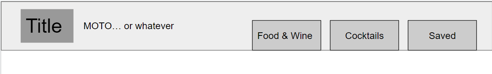
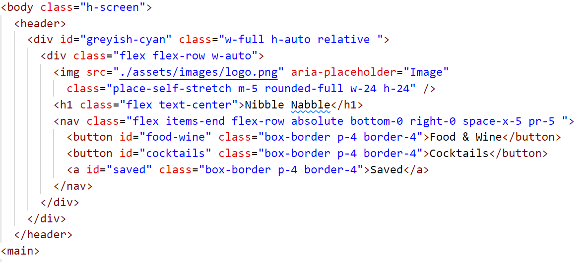
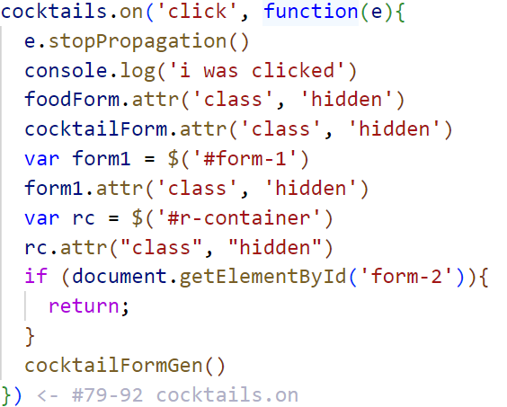

# Nibble Nabble

## Technology Used 

| Technology Used         | Resource URL           | 
| ------------- |:-------------:| 
| HTML    | [https://developer.mozilla.org/en-US/docs/Web/HTML](https://developer.mozilla.org/en-US/docs/Web/HTML) |
| | [https://www.w3schools.com/html/html_basic.asp](https://www.w3schools.com/html/html_basic.asp)     | 
| CSS     | [https://developer.mozilla.org/en-US/docs/Web/CSS](https://developer.mozilla.org/en-US/docs/Web/CSS)      |
| | [https://www.w3schools.com/css/css_intro.asp](https://www.w3schools.com/css/css_intro.asp)     |    
| Git | [https://git-scm.com/](https://git-scm.com/)     | 
| | [https://git-scm.com/book/en/v2/Git-Branching-Branching-Workflows](https://git-scm.com/book/en/v2/Git-Branching-Branching-Workflows) |
| | [https://www.learnenough.com/git-tutorial/getting_started](https://www.learnenough.com/git-tutorial/getting_started) |
| JavaScript | [https://developer.mozilla.org/en-US/docs/Web/JavaScript](https://developer.mozilla.org/en-US/docs/Web/JavaScript)     | 
|   | [https://tailwindcss.com/docs](https://tailwindcss.com/docs) |
| | [https://www.w3schools.com/js/default.asp](https://www.w3schools.com/js/default.asp)     |   
| | [https://davidwalsh.name/event-delegate](https://davidwalsh.name/event-delegate)     |
| JQuery    | [https://jquery.com/](https://jquery.com/) |
|     | [https://www.w3schools.com/jquery/](https://www.w3schools.com/jquery/) |
| Tailwind    | [https://tailwindcss.com/docs](https://tailwindcss.com/docs) |
| TheCockTailDB   | [https://www.thecocktaildb.com/api.php](https://www.thecocktaildb.com/api.php) |
| Spoonacular API    | [https://spoonacular.com/food-api/docs](https://spoonacular.com/food-api/docs) |
| Edamam  | [https://developer.edamam.com/edamam-docs-recipe-api](https://developer.edamam.com/edamam-docs-recipe-api) |
| Agile Methodology    | [https://en.wikipedia.org/wiki/Agile_software_development](https://en.wikipedia.org/wiki/Agile_software_development) |
| Tailwind    | [https://tailwindcss.com/docs](https://tailwindcss.com/docs) |
| Form Validation    | [https://www.geeksforgeeks.org/form-validation-using-jquery/](https://www.geeksforgeeks.org/form-validation-using-jquery/) |

## Description 

[Visit the Deployed Site](https://megellman.github.io/group-project/)

Nibble Nabble is designed for the on the go host. With our easy to use design you can plan multiple dinner party menu with cocktails and paired wines. You just search what you are looking for and simply save under the dinner party name you are hosting. 

## Table of Contents 

* [Technology Used](#Technology-Used)
* [Description](#Description)
* [User Story Example](#code-refactor-example)
* [Learning Points](#learning-points)
* [Contributors](#Contributors)

## User Story Example Example

AS A Host
I WANT to be able to easily navigate a recipe site
SO THAT I can find what I am looking for

We want our users to be able to navigate multiple ways to get to whatever portion of our site they want to be on with as few clicks possible. In our wire frame we have a conceptual nav bar that will do just that. 

we write out our nave bar in HTML and style it with Tailwind. For consistency copy this code snippet into each page of our site. This allows our our users to acesses miltiple sections of our website with just one click.  The logo even takes you back to the homepage.

In our JS we have event handlers on all of the tabs. When you click on the two search tabs they hide the content of the current page that you are on and dynamically generate the search form. 
We had a moment of pivot in our design while in our learning process we discovered that when you change HTML pages the DOM loads fresh and you are not able to tell an event handler to switch the page and then perform other tasks. This is why we chose to dynamically generate our form and instead of bring the user to it we now bring it to the user. 

## Learning Points 

On this project, we strengthened and learned:

* Github
    * Branching
    * Merge conflict resolution
* REST API's
* JQuery
* Tailwind
* JavaScript
* CSS
* HTML

## Contributors

### Megan Ellman

* [Portfolio](https://megellman.github.io/portfolio/)
* [LinkedIn](https://www.linkedin.com/in/megan-ellman/)
* [Github](https://github.com/megellman)

### Peter Shaughnessy

* [Portfolio](https://prnessy23.github.io/Portfolio/)
* [LinkedIn](https://www.linkedin.com/in/petershaughnessy/)
* [Github](https://github.com/prnessy23)

### Michael Reyna

* [Portfolio](https://michaelreyna25.github.io/portfolio/)
* [LinkedIn](https://www.linkedin.com/in/michael-reyna-35b597245/)
* [Github](https://github.com/michaelreyna25)

### Becka McNally

* [Portfolio](https://beckamcnally.github.io/beckamcnally/)
* [LinkedIn](https://www.linkedin.com/in/becka-mcnally-21520670/)
* [Github](https://github.com/beckamcnally)
